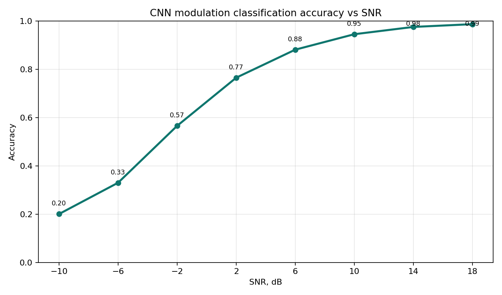
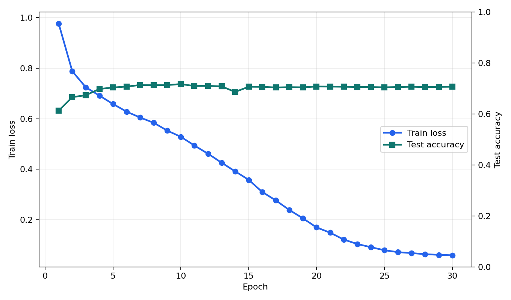
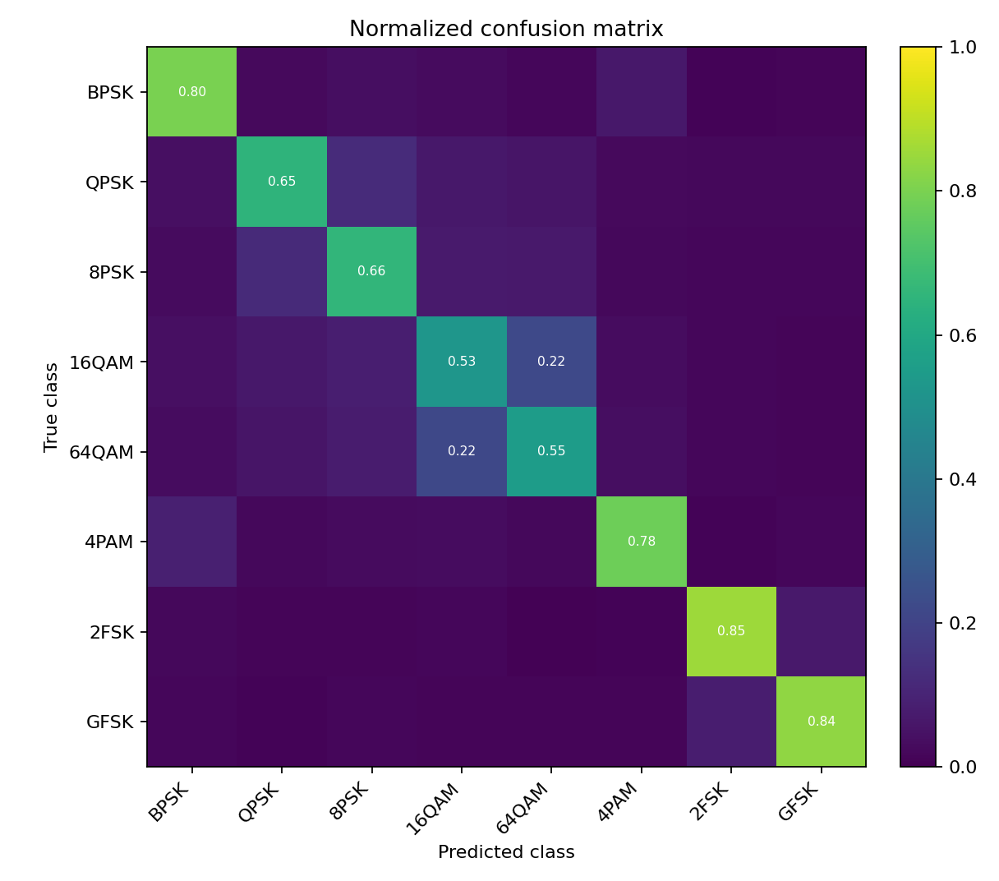

# Modulation classification experiment

Код и результаты эксперимента по классификации типов модуляции по IQ-сигналам.

## Файлы

- `gpu_experiment/amc_cnn_experiment.py` - генерация данных, обучение 1D-CNN, сохранение метрик.
- `gpu_experiment/requirements.txt` - зависимости кроме PyTorch.
- `results/` - результаты запуска на RTX 4060 Laptop GPU.

## Запуск

```bash
python -m venv .venv
source .venv/bin/activate
pip install --upgrade pip
pip install torch torchvision torchaudio --index-url https://download.pytorch.org/whl/cu121
pip install -r gpu_experiment/requirements.txt
python gpu_experiment/amc_cnn_experiment.py --output-dir results
```

Windows PowerShell:

```powershell
.\.venv\Scripts\Activate.ps1
```

Быстрая проверка без CUDA:

```bash
python gpu_experiment/amc_cnn_experiment.py --allow-cpu --epochs 1 --train-per-class-snr 2 --test-per-class-snr 1 --output-dir temp/smoke_results
```

## Последний запуск

- GPU: NVIDIA GeForce RTX 4060 Laptop GPU, 8 GB
- PyTorch: 2.5.1+cu121
- CUDA: 12.1
- epochs: 30
- train/test: 57 600 / 15 360
- итоговая accuracy: 70,67%
- лучшее значение accuracy: 71,72%
- время обучения: 80,81 с

Подробный лог: `results/gpu_run_log.txt`.

## Accuracy по SNR

| SNR, дБ | Accuracy, % |
|---:|---:|
| -10 | 20,05 |
| -6 | 33,02 |
| -2 | 56,61 |
| 2 | 76,56 |
| 6 | 88,18 |
| 10 | 94,58 |
| 14 | 97,60 |
| 18 | 98,75 |






